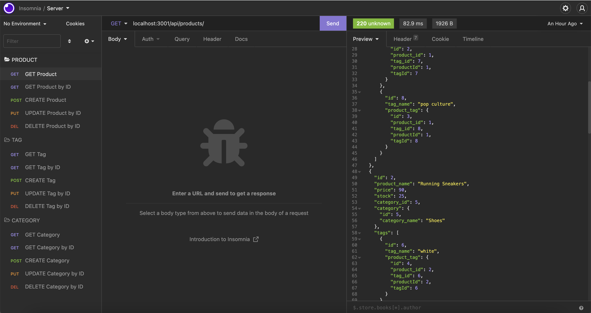
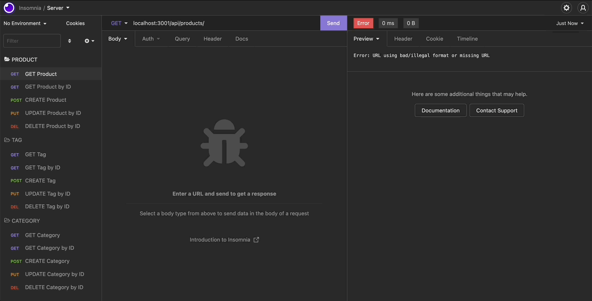

# Week13-Homework

# E-Commerce Backend

## Description 

This is a simple application to demonstrate the use of sequalize in the ORM enviroment. 
We create and seed a database using sequalize and then we can use GET, POST, PUT and DELETE to SELECT, UPDATE, CREATE and DELETE from our database. All while using the JS code we all know and love.        

## Table of contents 

- [Screenshots](#screenshots) 
- [Technologies](#technologies) 
- [Installation](#installation)
- [Resources](#resources) 
- [Contact](#contact)
  
## Screenshots 
---

*Insomnia Info*



*Demo*



## Technologies
***
A list of technologies used within the project:

- Javascript
- GIT
- Insomnia
- MySQL
- Sequalize
- Express.js
- Node.js
- Dotenv

## Installation
***
To install and use this app please run the below in your CLI.
```
$ cd /Users/chaz/Bootcamp/week13/ecommerce-backend/server.js
$ npm install
$ npm start
```
Note: This application is only a partial app and it can be tested using Insomnia.

## Resources

[Github Repo](https://github.com/mckayjalex/ecommerce-backend)

[Walkthorugh Video](https://youtu.be/hMyAJ9gBZzw)

## Contact

GitHub: [GitHub](https://github.com/mckayjalex) Email: [alexjosephmckay@gmail.com](alexjosephmckay@gmail.com)